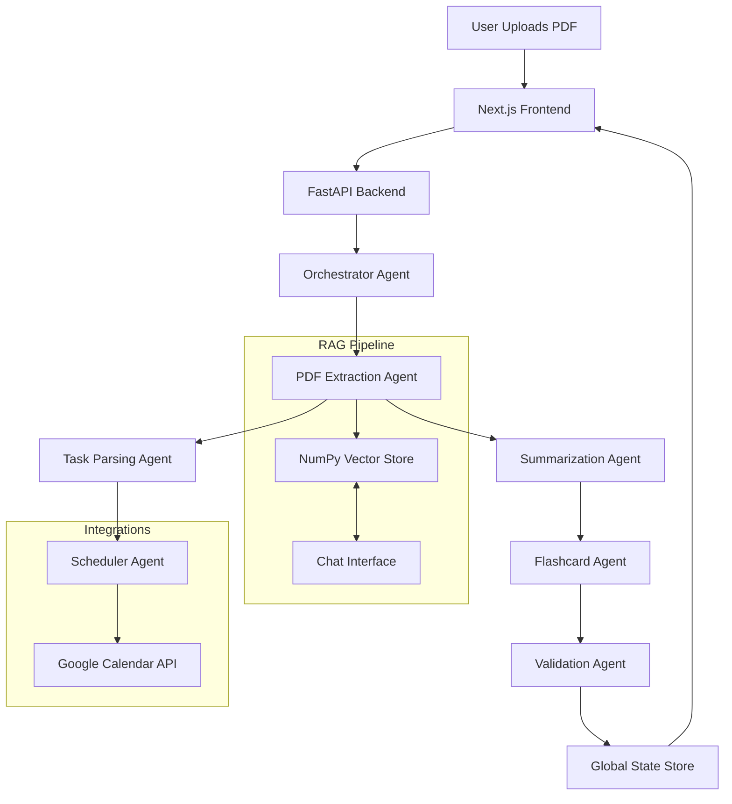

# 🎓 ScholarFlow AI

<div align="center">


**Autonomous Academic Workflow Automation**  
*Powered by Google Gemini 2.5 & Agent Development Kit (ADK)*

[](https://nextjs.org/)
[](https://fastapi.tiangolo.com/)
[](https://ai.google.dev/)
[](https://python.org)
[](LICENSE)

[Features](#-features) • [Architecture](#-architecture) • [Installation](#-installation) • [Usage](#-usage) • [Tech Stack](#-tech-stack)

</div>

---

## 💡 The Problem
Students are overwhelmed with unstructured information—syllabi, lecture notes, handouts, and research papers. Manually extracting deadlines, creating study schedules, and generating flashcards is tedious and error-prone.

## 🚀 The Solution: ScholarFlow AI
**ScholarFlow AI** is an intelligent multi-agent system that transforms chaos into order. Upload any academic PDF, and our agents autonomously:
1.  **Extract** actionable tasks and deadlines.
2.  **Plan** a personalized study schedule.
3.  **Summarize** complex topics into key takeaways.
4.  **Generate** active recall flashcards.
5.  **Answer** your questions via a RAG-powered chat.
6.  **Automate** your calendar by directly adding study sessions to Google Calendar.

---

## ✨ Features

| Feature | Description |
| :--- | :--- |
| **📄 Intelligent Ingestion** | Extracts text, structure, and metadata from PDFs using OCR and layout analysis. |
| **📅 Auto-Scheduling** | Parses assignments and deadlines to build a day-wise study plan optimized for your workload. |
| **🧠 AI Summarization** | Uses **Gemini 2.5 Pro** to generate concise executive summaries and bulleted key points. |
| **📇 Smart Flashcards** | Automatically generates Q/A flashcards tagged by topic for efficient revision. |
| **💬 RAG Chat** | "Chat with your Document" using a custom NumPy-based vector store and **Gemini Embeddings**. |
| **📆 Google Calendar Integration** | Seamlessly adds study sessions to your Google Calendar with a single click. |
| **📊 Modern Dashboard** | A sleek, responsive Next.js UI with dark mode, history tracking, and real-time updates. |

---

## 🛠️ Architecture

ScholarFlow AI utilizes a modern decoupled architecture with a FastAPI backend and Next.js frontend.



### Core Agents
- **OrchestratorAgent**: Manages the lifecycle and state of the pipeline.
- **PDFExtractionAgent**: Handles file processing, OCR, and RAG indexing.
- **TaskParsingAgent**: Identifies actionable items (assignments, exams) and dates using LLMs.
- **SummarizationAgent**: Synthesizes content using LLMs.
- **FlashcardAgent**: Generates study aids.
- **SchedulerAgent**: Optimizes time management based on extracted dates.
- **ValidationAgent**: Ensures output quality and consistency.

---

## 📦 Installation

### Prerequisites
- Python 3.10 or higher
- Node.js 18+ and npm
- A Google Cloud Project with Gemini API access and Google Calendar API enabled.

### Steps

1.  **Clone the Repository**
    ```bash
    git clone https://github.com/yourusername/scholarflow-ai.git
    cd scholarflow-ai
    ```

2.  **Backend Setup**
    ```bash
    # Create virtual environment
    python -m venv venv
    
    # Activate (Windows)
    .\venv\Scripts\activate
    # Activate (Mac/Linux)
    source venv/bin/activate
    
    # Install dependencies
    pip install -r requirements.txt
    ```

3.  **Frontend Setup**
    ```bash
    cd frontend
    npm install
    cd ..
    ```

4.  **Google Cloud Credentials**
    - Place your `client_secret.json` (for Google Calendar) in the project root.
    - Obtain a Google Gemini API Key.

---

## 🏃 Usage

1.  **Start the Backend**
    ```bash
    # In the root directory
    uvicorn api:app --reload
    ```

2.  **Start the Frontend**
    ```bash
    # In the frontend directory
    npm run dev
    ```

3.  **Access the App**
    - Open `http://localhost:3000` in your browser.
    - Go to **Settings** (Sidebar) and enter your **Google Gemini API Key**.
    - Go to **Dashboard** and click **"Connect Calendar"** to enable Google Calendar integration.

4.  **Start Automating**
    - **Upload**: Drag & drop your PDF (Syllabus, Notes, Paper) on the Home page.
    - **View**: Explore the **Dashboard** for your schedule, summary, and flashcards.
    - **Chat**: Use the **Chat** tab to ask specific questions about the document.

---

## 💻 Tech Stack

- **LLM**: Google Gemini 2.5 Pro
- **Embeddings**: Google Gemini Text Embeddings 004
- **Backend**: FastAPI, Python 3.10+
- **Frontend**: Next.js 14, Tailwind CSS, Lucide Icons
- **Framework**: Google Agent Development Kit (Custom Implementation)
- **Vector Store**: Custom NumPy-based Store (Lightweight & Fast)
- **PDF Processing**: PyMuPDF, PyTesseract

---

## 📂 Project Structure

```
scholarflow-ai/
├── api.py                   # FastAPI Backend Entry Point
├── campus_taskflow/         # Core Agent Logic
│   ├── adk/                 # Agent Development Kit primitives
│   ├── agents/              # Specialized Agents
│   └── tools/               # Tools (PDF Reader, Search, Date Parser)
├── frontend/                # Next.js Frontend Application
│   ├── app/                 # App Router Pages
│   ├── components/          # UI Components
│   └── public/              # Static Assets
├── tests/                   # Unit tests
├── requirements.txt         # Python dependencies
└── client_secret.json       # Google OAuth Credentials (Ignored)
```

---

## 🤝 Contributing

Contributions are welcome! Please feel free to submit a Pull Request.

1. Fork the Project
2. Create your Feature Branch (`git checkout -b feature/AmazingFeature`)
3. Commit your Changes (`git commit -m 'Add some AmazingFeature'`)
4. Push to the Branch (`git push origin feature/AmazingFeature`)
5. Open a Pull Request

---

## 📄 License

This project is licensed under the MIT License - see the [LICENSE](LICENSE) file for details.
