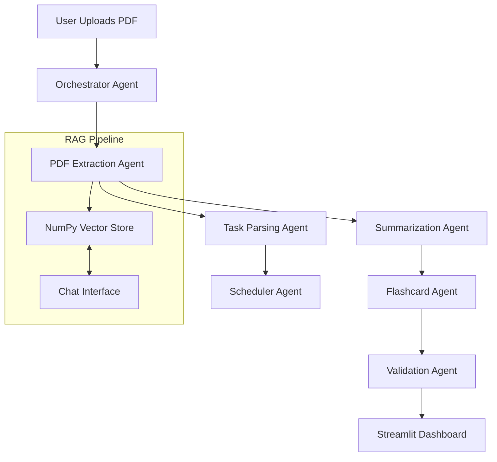

# 🎓 ScholarFlow AI

<div align="center">


**Autonomous Academic Workflow Automation**  
*Powered by Google Gemini 2.5 & Agent Development Kit (ADK)*

[](https://streamlit.io)
[](https://ai.google.dev/)
[](https://python.org)
[](LICENSE)

[Features](#-features) • [Architecture](#-architecture) • [Installation](#-installation) • [Usage](#-usage) • [Tech Stack](#-tech-stack)

</div>

---

## 💡 The Problem
Students are overwhelmed with unstructured information—syllabi, lecture notes, handouts, and research papers. Manually extracting deadlines, creating study schedules, and generating flashcards is tedious and error-prone.

## 🚀 The Solution: ScholarFlow AI
**ScholarFlow AI** is an intelligent multi-agent system that transforms chaos into order. Upload any academic PDF, and our agents autonomously:
1.  **Extract** actionable tasks and deadlines.
2.  **Plan** a personalized study schedule.
3.  **Summarize** complex topics into key takeaways.
4.  **Generate** active recall flashcards.
5.  **Answer** your questions via a RAG-powered chat.

---

## ✨ Features

| Feature | Description |
| :--- | :--- |
| **📄 Intelligent Ingestion** | Extracts text, structure, and metadata from PDFs using OCR and layout analysis. |
| **📅 Auto-Scheduling** | Parses assignments and deadlines to build a day-wise study plan optimized for your workload. |
| **🧠 AI Summarization** | Uses **Gemini 2.5 Pro** to generate concise executive summaries and bulleted key points. |
| **📇 Smart Flashcards** | Automatically generates Q/A flashcards tagged by topic for efficient revision. |
| **💬 RAG Chat** | "Chat with your Document" using a custom NumPy-based vector store and **Gemini Embeddings**. |
| **📊 Pro Dashboard** | A modern Streamlit UI with metrics, history tracking, and a clean professional design. |

---

## 🛠️ Architecture

ScholarFlow AI utilizes a sequential multi-agent pipeline built on Google ADK primitives.



### Core Agents
- **OrchestratorAgent**: Manages the lifecycle and state of the pipeline.
- **PDFExtractionAgent**: Handles file processing, OCR, and RAG indexing.
- **TaskParsingAgent**: Identifies actionable items (assignments, exams) and dates.
- **SummarizationAgent**: Synthesizes content using LLMs.
- **FlashcardAgent**: Generates study aids.
- **SchedulerAgent**: Optimizes time management based on extracted dates.
- **ValidationAgent**: Ensures output quality and consistency.

---

## 📦 Installation

### Prerequisites
- Python 3.10 or higher
- A Google Cloud Project with Gemini API access

### Steps

1.  **Clone the Repository**
    ```bash
    git clone https://github.com/yourusername/scholarflow-ai.git
    cd scholarflow-ai
    ```

2.  **Create Virtual Environment**
    ```bash
    python -m venv venv
    # Windows
    .\venv\Scripts\activate
    # Mac/Linux
    source venv/bin/activate
    ```

3.  **Install Dependencies**
    ```bash
    pip install -r requirements.txt
    ```

---

## 🏃 Usage

1.  **Launch the Application**
    ```bash
    streamlit run campus_taskflow/ui/app.py
    ```

2.  **Configure API Key**
    - The app will open in your browser (usually `http://localhost:8501`).
    - Open the **Sidebar**.
    - Enter your **Google Gemini API Key** in the settings panel.

3.  **Start Automating**
    - **Upload**: Drag & drop your PDF (Syllabus, Notes, Paper).
    - **Run**: Click **Start TaskFlow Pipeline**.
    - **View**: Explore the **Dashboard** for your schedule, summary, and flashcards.
    - **Chat**: Use the **Chat** tab to ask specific questions about the document.

---

## 💻 Tech Stack

- **LLM**: Google Gemini 2.5 Pro
- **Embeddings**: Google Gemini Text Embeddings 004
- **Framework**: Google Agent Development Kit (Custom Implementation)
- **Frontend**: Streamlit + Streamlit Extras
- **Vector Store**: Custom NumPy-based Store (Lightweight & Fast)
- **PDF Processing**: PyMuPDF, PyTesseract

---

## 📂 Project Structure

```
scholarflow-ai/
├── campus_taskflow/
│   ├── adk/                 # Core Agent Development Kit primitives
│   ├── agents/              # Specialized Agents (Orchestrator, Extractor, etc.)
│   ├── tools/               # Tools (PDF Reader, Search, Date Parser)
│   └── ui/                  # Streamlit User Interface
├── tests/                   # Unit tests
├── requirements.txt         # Project dependencies
└── main.py                  # CLI Entry point
```

---

## 🤝 Contributing

Contributions are welcome! Please feel free to submit a Pull Request.

1. Fork the Project
2. Create your Feature Branch (`git checkout -b feature/AmazingFeature`)
3. Commit your Changes (`git commit -m 'Add some AmazingFeature'`)
4. Push to the Branch (`git push origin feature/AmazingFeature`)
5. Open a Pull Request

---

## 📄 License

This project is licensed under the MIT License - see the [LICENSE](LICENSE) file for details.
